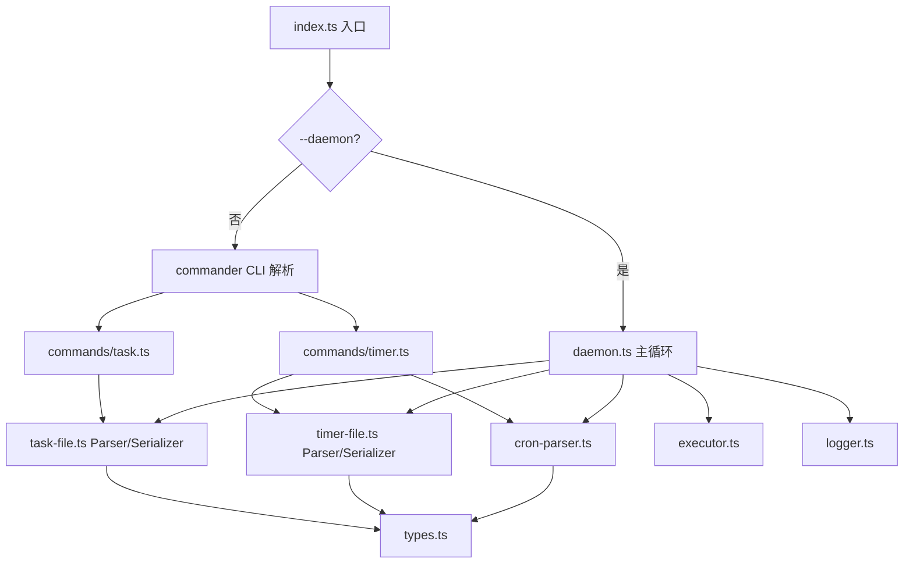

# 设计文档：notifier-daemon

## 概述

notifier 是一个 TypeScript/Node.js 命令行工具，支持两种运行模式：

- **CLI 模式**：通过子命令管理即时任务（task）和定时任务（timer），执行完即退出。
- **Daemon 模式**：以 `--daemon` 启动，常驻后台，监听文件变动和 CRON 时间信号，自动执行 Shell 命令。

技术栈：TypeScript + ESM，构建工具 tsup，测试框架 vitest，CLI 解析 commander，运行时 Node.js 20+。

---

## 架构



### 数据流：CLI task add

```
用户输入 → commander 解析 → task.ts → task-file.ts 序列化 → 写入 tasks/pending/<author>-<task_id>.txt
```

### 数据流：Daemon 即时任务

```
fs.watch 事件 → daemon.ts → task-file.ts 解析 → executor.ts 执行 → 移动文件到 done/error
```

### 数据流：Daemon 定时任务

```
启动扫描 timers/ → cron-parser.ts 解析 → Job Table → 主循环计算 sleep → 到期执行 → executor.ts
```

---

## 组件与接口

### `types.ts` — 共享类型定义

```typescript
export interface TaskFile {
  author: string;
  task_id: string;
  command: string;
  created_at: string;       // ISO 8601
  description?: string;
}

export interface TimerFile {
  author: string;
  task_id: string;
  command: string;
  timer: string;            // CRON 表达式
  timer_desc: string;       // 自动生成的英文描述
  created_at: string;       // ISO 8601
  description?: string;
  on_miss?: 'skip' | 'run-once';  // 错过触发时的处理策略，默认 skip
}

export interface ParseResult<T> {
  ok: true;
  value: T;
} | {
  ok: false;
  error: string;
}

export interface CronParseResult {
  nextTime: Date;
  description: string;
}

export type TaskStatus = 'pending' | 'done' | 'error';
```

### `task-file.ts` — 即时任务文件 Parser/Serializer

**接口：**

```typescript
// 解析 env 格式字符串为 TaskFile 对象
export function parseTaskFile(content: string): ParseResult<TaskFile>

// 将 TaskFile 对象序列化为 env 格式字符串
export function serializeTaskFile(task: TaskFile): string

// 生成文件名
export function taskFileName(author: string, taskId: string): string
// 返回: "<author>-<task_id>.txt"
```

**解析规则：**
- 按行分割，忽略空行和 `#` 开头的注释行。
- 每行按第一个 `=` 分割为 key/value。
- 必需字段：`author`、`task_id`、`command`、`created_at`。
- 缺少任意必需字段时返回错误，错误信息包含缺失字段名。

### `timer-file.ts` — 定时任务文件 Parser/Serializer

**接口：**

```typescript
export function parseTimerFile(content: string): ParseResult<TimerFile>
export function serializeTimerFile(timer: TimerFile): string
export function timerFileName(author: string, taskId: string): string
```

**解析规则：**
- 必需字段：`author`、`task_id`、`command`、`timer`、`timer_desc`、`created_at`。
- 可选字段：`description`、`on_miss`（合法值：`skip` | `run-once`，默认 `skip`）。
- `on_miss` 值非法时返回错误，错误信息包含字段名和合法值列表。
- 其余规则与 `task-file.ts` 相同。

### `cron-parser.ts` — CRON 表达式解析

**接口：**

```typescript
// 验证并解析 CRON 表达式，返回描述和下一次触发时间
export function parseCron(expr: string, now?: Date): ParseResult<CronParseResult>

// 仅生成英文可读描述
export function describeCron(expr: string): ParseResult<string>
```

**CRON 字段范围：**

| 字段 | 位置 | 合法范围 |
|------|------|----------|
| 分钟 | 0 | 0–59 |
| 小时 | 1 | 0–23 |
| 日   | 2 | 1–31 |
| 月   | 3 | 1–12 |
| 周   | 4 | 0–7（0 和 7 均表示周日） |

支持：`*`、数字、`*/n`（步进）、`a-b`（范围）、`a,b,c`（列表）。

**实现策略：** 自行实现轻量级 CRON 解析（不引入外部 cron 库），仅支持标准 5 字段格式。下一次触发时间通过从当前时间向前逐分钟推进计算（最多推进 366 天）。

### `executor.ts` — Shell 命令执行器

**实现策略：** 直接从 `pai/src/os-utils.ts` 复制，不重新实现。复用其中的 `spawnCommand` 函数（以 `sh -c <command>` 方式执行，继承 stdio）。

**接口：**

```typescript
export interface ExecuteResult {
  exitCode: number;
  durationMs: number;
}

// 执行 Shell 命令，返回退出码和耗时
// 内部使用 pai/src/os-utils.ts 的 spawnCommand 实现
export async function executeCommand(command: string): Promise<ExecuteResult>
```

notifier 的 `executor.ts` 是对 `os-utils.ts` 的薄封装，额外记录 `durationMs`。`os-utils.ts` 本身直接复制到 `src/os-utils.ts`。

### `logger.ts` — 日志模块

**接口：**

```typescript
export type LogLevel = 'INFO' | 'WARN' | 'ERROR';

export interface Logger {
  info(message: string): void;
  warn(message: string): void;
  error(message: string): void;
  close(): Promise<void>;
}

// 创建写入文件的 Logger（Daemon 使用）
export function createFileLogger(logDir: string): Promise<Logger>

// 创建写入 stderr 的 Logger（CLI 使用）
export function createStderrLogger(): Logger
```

**日志格式：** `[<ISO8601>] [<LEVEL>] <message>`

**日志轮换：** 在 `createFileLogger` 初始化时检查 `notifier.log` 行数，若超过 10000 行则重命名为 `notifier-<YYYYMMDD-HHmmss>.log` 并创建新文件。

### `daemon.ts` — Daemon 主循环

**主循环逻辑：**

```
1. Initialize
   - 创建 Logger，记录启动事件
   - 扫描 timers/ 构建 Job Table
   - 扫描 tasks/pending/ 处理残留文件

2. 注册信号处理（SIGTERM/SIGINT）
   - 设置 shuttingDown 标志
   - 等待当前任务完成后退出

3. 主循环（while !shuttingDown）
   a. 计算最近 CRON 触发时间 → sleep 时长 T
   b. 启动 fs.watch 监听 tasks/pending/
   c. Promise.race([fileEvent, timeout(T), shutdownSignal])
   d. 根据事件类型分发处理：
      - 文件事件 → 处理即时任务
      - 超时 → 执行到期 CRON 任务
      - 关闭信号 → 退出循环
```

**Job Table 结构：**

```typescript
interface Job {
  timer: TimerFile;
  nextRun: Date;
  lastRun?: Date;  // 用于 on_miss=run-once 的补跑判断
}

// Map<filename, Job>
type JobTable = Map<string, Job>;
```

**on_miss 处理逻辑（Daemon 启动时）：**

```
for each job in JobTable:
  if job.timer.on_miss === 'run-once':
    prevTrigger = 上一次应触发时间（相对于 now 向前推算）
    if prevTrigger exists (daemon 停止期间有触发被错过):
      立即执行一次命令，记录日志
  else (skip，默认):
    直接计算 nextRun，跳过所有错过的触发
```

### `commands/task.ts` — task 子命令

实现 `task add`、`task list`、`task remove` 三个子命令，通过 commander 注册。

### `commands/timer.ts` — timer 子命令

实现 `timer add`、`timer list`、`timer remove` 三个子命令，通过 commander 注册。

### `commands/status.ts` — status 子命令

**接口：**

```typescript
export interface DaemonStatus {
  running: boolean;
  pid: number | null;
}

// 读取 PID 文件，检查进程是否存活
export async function getDaemonStatus(home: string): Promise<DaemonStatus>
```

**行为：**
- 读取 `$NOTIFIER_HOME/notifier.pid`。
- 若文件不存在：`{ running: false, pid: null }`。
- 若文件存在：读取 PID，用 `process.kill(pid, 0)` 检查进程是否存活（不抛异常则存活）。
- 文本输出示例：
  - 运行中：`Daemon is running (PID: 12345)`
  - 未运行：`Daemon is not running`
- `--json` 输出：`{"running": true, "pid": 12345}` 或 `{"running": false, "pid": null}`

### `pid-file.ts` — PID 文件管理

```typescript
// 写入当前进程 PID
export async function writePidFile(home: string): Promise<void>

// 删除 PID 文件
export async function removePidFile(home: string): Promise<void>

// 读取 PID 文件，返回 PID 或 null（文件不存在时）
export async function readPidFile(home: string): Promise<number | null>

// 检查 PID 对应进程是否存活
export function isProcessAlive(pid: number): boolean
```

**单实例启动逻辑（在 `daemon.ts` 中）：**

```
1. 读取 notifier.pid
2. 若文件存在：
   a. 读取 PID
   b. isProcessAlive(pid) === true → 报错退出（退出码 1）
   c. isProcessAlive(pid) === false → stale lock，记录 WARN 日志，继续
3. 写入当前 PID 到 notifier.pid
4. 注册退出清理：process.on('exit', removePidFile)
   （SIGTERM/SIGINT 处理器中也调用 removePidFile）
```

### `help.ts` — 帮助输出

实现渐进披露的帮助文本，`--help` 输出简洁版（50 行以内），`--help --verbose` 输出完整版。

### `index.ts` — 入口

```typescript
// 检测 --daemon 标志
if (process.argv.includes('--daemon')) {
  await runDaemon();
} else {
  // commander CLI 解析
  program.parse(process.argv);
}
```

---

## 数据模型

### 目录结构

```
$NOTIFIER_HOME/           # 默认: ~/.local/share/notifier/
├── tasks/
│   ├── pending/          # 待执行的即时任务文件
│   ├── done/             # 已成功执行的即时任务文件
│   └── error/            # 格式错误的即时任务文件
├── timers/               # 定时任务文件
├── notifier.pid          # Daemon PID 文件（运行时存在）
└── logs/
    ├── notifier.log      # 当前活跃日志
    └── notifier-<ts>.log # 轮换后的历史日志
```

### 即时任务文件（env 格式）

```
author=<string>
task_id=<string>
command=<string>
created_at=<ISO8601>
description=<string>  # 可选
```

文件名：`<author>-<task_id>.txt`

### 定时任务文件（env 格式）

```
author=<string>
task_id=<string>
command=<string>
timer=<cron-expr>
timer_desc=<string>
created_at=<ISO8601>
description=<string>  # 可选
on_miss=skip|run-once  # 可选，默认 skip
```

文件名：`<author>-<task_id>.txt`

---

## 正确性属性（Correctness Properties）

*属性（Property）是在系统所有合法执行中都应成立的特征或行为——本质上是关于系统应做什么的形式化陈述。属性是人类可读规范与机器可验证正确性保证之间的桥梁。*

### Property 1：即时任务文件 Round-Trip

*对于任意* 合法的 `TaskFile` 对象，将其序列化为 env 格式字符串后再解析，应得到与原对象等价的 `TaskFile` 对象。

即：`parseTaskFile(serializeTaskFile(task))` 应等价于 `task`。

**Validates: Requirements 2.5, 2.6**

---

### Property 2：定时任务文件 Round-Trip

*对于任意* 合法的 `TimerFile` 对象（包含 `on_miss` 字段的所有合法值），将其序列化为 env 格式字符串后再解析，应得到与原对象等价的 `TimerFile` 对象。

即：`parseTimerFile(serializeTimerFile(timer))` 应等价于 `timer`。

**Validates: Requirements 3.7, 3.8**

---

### Property 3：缺失必需字段时错误信息包含字段名

*对于任意* 即时任务或定时任务文件，若缺少任意一个必需字段，解析器返回的错误信息应包含该缺失字段的名称。

**Validates: Requirements 2.3, 3.3**

---

### Property 3b：on_miss 非法值时错误信息包含字段名和合法值

*对于任意* 包含非法 `on_miss` 值的定时任务文件，解析器返回的错误信息应包含 `on_miss` 字段名以及合法值列表（`skip`、`run-once`）。

**Validates: Requirements 3.6**

---

### Property 4：CRON 下一次触发时间不早于当前时间

*对于任意* 合法的 CRON 表达式和任意当前时间 `now`，`parseCron(expr, now)` 计算的下一次触发时间 `nextTime` 应满足 `nextTime > now`。

**Validates: Requirements 4.6**

---

### Property 5：非法 CRON 字段数量返回错误

*对于任意* 字段数量不等于 5 的字符串（以空白分割），`parseCron` 应返回错误结果（`ok: false`）。

**Validates: Requirements 4.2**

---

### Property 6：非法 CRON 字段值错误信息包含字段名

*对于任意* 包含非法字段值的 CRON 表达式，`parseCron` 返回的错误信息应包含出错字段的名称（minute/hour/day/month/weekday）。

**Validates: Requirements 4.3**

---

### Property 7：task list --json 输出合法 JSON 数组

*对于任意* `tasks/pending/` 目录下的任务文件集合，执行 `notifier task list --json` 的输出应为合法的 JSON 数组，且数组中每个元素包含 `author`、`task_id`、`command` 字段。

**Validates: Requirements 6.3**

---

### Property 8：timer list --json 输出合法 JSON 数组

*对于任意* `timers/` 目录下的定时任务文件集合，执行 `notifier timer list --json` 的输出应为合法的 JSON 数组，且数组中每个元素包含 `author`、`task_id`、`timer`、`timer_desc`、`command` 字段。

**Validates: Requirements 9.2**

---

### Property 9：错误输出到 stderr 且包含修复建议

*对于任意* 触发错误的 CLI 操作（文件已存在、文件不存在、参数缺失等），错误信息应输出到 stderr（而非 stdout），且信息中应包含可操作的修复建议。

**Validates: Requirements 16.1, 16.2**

---

### Property 10：--json 模式下错误以 JSON 格式输出

*对于任意* 在 `--json` 模式下触发错误的 CLI 操作，stderr 输出应为合法 JSON 对象，且包含 `error` 和 `suggestion` 两个字段。

**Validates: Requirements 16.3**

---

### Property 11：Daemon 即时任务幂等性

*对于任意* 放入 `tasks/pending/` 的任务文件，Daemon 处理后该文件应恰好出现在 `tasks/done/` 或 `tasks/error/` 目录之一，且不再存在于 `tasks/pending/`（同一文件只被处理一次）。

**Validates: Requirements 12.7, 12.8**

---

### Property 12：日志行格式符合规范

*对于任意* Daemon 写入的日志行，其格式应符合 `[<ISO8601>] [<LEVEL>] <message>` 模式，其中 LEVEL 为 `INFO`、`WARN` 或 `ERROR` 之一。

**Validates: Requirements 15.2**

---

### Property 13：status --json 输出合法 JSON 且字段类型正确

*对于任意* Daemon 运行状态（运行中或未运行），`notifier status --json` 的输出应为合法 JSON 对象，且包含 `running`（boolean）和 `pid`（number 或 null）字段，且两者类型一致：`running=true` 时 `pid` 为正整数，`running=false` 时 `pid` 为 null。

**Validates: Requirements 18.4**

---

## 错误处理

### 退出码约定

| 退出码 | 含义 |
|--------|------|
| `0` | 成功 |
| `1` | 一般错误（文件不存在、重复添加等） |
| `2` | 参数/用法错误（参数缺失、CRON 格式错误、自动 --help 触发） |

### 错误信息格式

所有错误信息输出到 stderr，包含两部分：
1. 问题描述（什么错了）
2. 修复建议（怎么修）

示例：
```
Error: task file already exists at ~/.local/share/notifier/tasks/pending/agent-007-build-42.txt.
Suggestion: Use a different --task-id or remove the existing task first with: notifier task remove --author agent-007 --task-id build-42
```

`--json` 模式下：
```json
{"error": "task file already exists at ...", "suggestion": "Use a different --task-id or ..."}
```

### Daemon 错误恢复

- 任务文件格式错误：移动到 `tasks/error/`，记录日志，继续运行。
- 命令执行失败（非零退出码）：记录错误日志，文件仍移动到 `tasks/done/`，继续运行。
- 定时任务文件格式错误：记录日志，跳过该文件，不影响其他任务。
- 文件系统操作失败：记录错误日志，继续运行（不崩溃）。

---

## 测试策略

### 测试框架

- **单元测试 / 集成测试**：vitest
- **Property-Based Testing**：`fast-check`（TypeScript PBT 库）
- 每个 property 测试最少运行 100 次迭代

### 从 pai repo 复用的代码

以下文件直接从 `pai` repo 复制，无需重新实现：

| 源文件 | 目标文件 | 说明 |
|--------|----------|------|
| `pai/src/os-utils.ts` | `src/os-utils.ts` | Shell 命令执行工具函数 |
| `pai/package.json` | `package.json` | 基础结构，调整 name/bin/dependencies |
| `pai/tsconfig.json` | `tsconfig.json` | 完全相同 |
| `pai/tsup.config.ts` | `tsup.config.ts` | 完全相同 |
| `pai/vitest.config.ts` | `vitest.config.ts` | 完全相同 |
| `pai/vitest/unit/bash-exec.test.ts` | `vitest/unit/os-utils.test.ts` | 适配后复用（测试 os-utils 的 spawnCommand/execCommand） |

### 目录结构

```
vitest/
├── unit/           # 单元测试（flat，无子目录）
├── pbt/            # Property-based 测试（flat）
├── fixtures/       # 测试 fixtures（示例任务文件等）
└── helpers/        # 测试辅助函数（临时目录、文件生成等）
```

### 单元测试覆盖

- `os-utils.ts`：从 pai 复制并适配（spawnCommand、execCommand）
- `task-file.ts`：解析合法文件、缺失字段错误、可选字段、序列化格式
- `timer-file.ts`：同上，针对定时任务字段；额外测试 `on_miss` 合法/非法值
- `cron-parser.ts`：合法表达式解析、非法字段数量、非法字段值、下一次触发时间计算
- `executor.ts`：命令执行成功/失败、退出码、耗时
- `logger.ts`：日志格式、日志轮换触发
- CLI 子命令：文件创建/删除/列表的集成测试（使用临时目录）

### Property-Based 测试覆盖

每个 Correctness Property 对应一个 PBT 测试，使用 `fast-check` 生成随机输入：

| Property | 测试文件 | fast-check 生成器 |
|----------|----------|-------------------|
| Property 1 | `pbt/task-file.pbt.test.ts` | `fc.record({author, task_id, command, created_at, description?})` |
| Property 2 | `pbt/timer-file.pbt.test.ts` | `fc.record({..., on_miss: fc.option(fc.constantFrom('skip','run-once'))})` |
| Property 3 | `pbt/parser-errors.pbt.test.ts` | 随机删除必需字段 |
| Property 3b | `pbt/parser-errors.pbt.test.ts` | 随机非法 on_miss 值 |
| Property 4 | `pbt/cron-parser.pbt.test.ts` | 合法 CRON 表达式生成器 + 随机时间 |
| Property 5 | `pbt/cron-parser.pbt.test.ts` | 字段数量 ≠ 5 的字符串 |
| Property 6 | `pbt/cron-parser.pbt.test.ts` | 包含非法字段值的 CRON 表达式 |
| Property 7 | `pbt/task-list.pbt.test.ts` | 随机任务文件集合 |
| Property 8 | `pbt/timer-list.pbt.test.ts` | 随机定时任务文件集合 |
| Property 9 | `pbt/cli-errors.pbt.test.ts` | 各种错误触发场景 |
| Property 10 | `pbt/cli-errors.pbt.test.ts` | --json 模式错误场景 |
| Property 11 | `pbt/daemon-idempotency.pbt.test.ts` | 随机任务文件集合 |
| Property 12 | `pbt/logger.pbt.test.ts` | 随机日志消息和级别 |
| Property 13 | `pbt/status.pbt.test.ts` | 模拟运行中/未运行状态 |

### 测试标注格式

每个 PBT 测试用注释标注对应的 property（与 pai repo 保持一致）：

```typescript
// Feature: notifier-daemon, Property 1: 即时任务文件 Round-Trip
it.prop([taskFileArb])('round-trip: parse(serialize(task)) === task', (task) => {
  // ...
});
```

### 测试辅助

- `helpers/tmp-dir.ts`：创建/清理临时 NOTIFIER_HOME 目录
- `helpers/file-gen.ts`：生成合法/非法任务文件内容；导出 fast-check 生成器（`taskFileArb`、`timerFileArb`、`validCronArb`）
- `fixtures/`：预置的合法和非法任务文件示例
